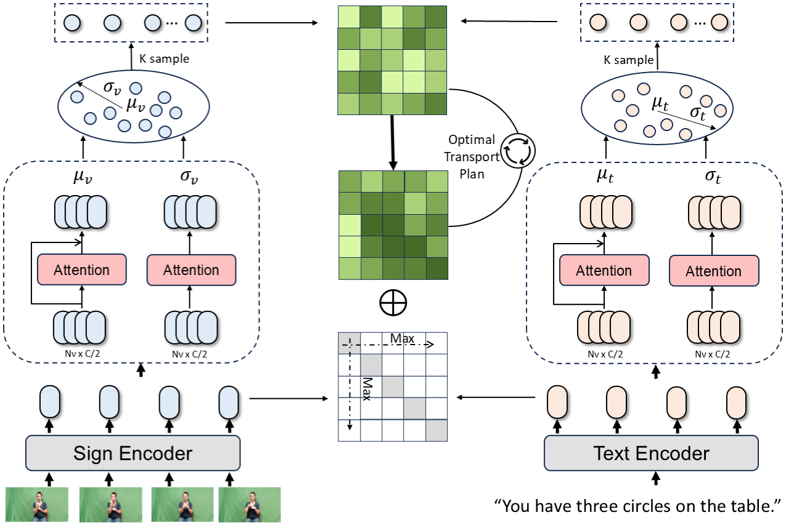

# UPRet
Official Implementations for [Uncertainty-aware Sign Language Video Retrieval with Probability Distribution Modeling](https://arxiv.org/pdf/2405.19689)

## Introduction

<p align="center">
  
  <br />
  <em>Illustration of: (a) Uncertainty. (b) Previous method. (C) Ours method</em>
</p>


  <br />

Sign language video retrieval is crucial for helping the hearing-impaired community to access information. Although significant progress has been made in the field of video-text retrieval, the complexity and inherent uncertainty of sign language make it difficult to directly apply these technologies. Previous methods have attempted to map sign language videos to text through fine-grained modality alignment. However, due to the scarcity of fine-grained annotations, the uncertainty in sign language videos has been underestimated, which has limited the further development of sign language retrieval tasks.

<br>

<p align="center">
  
  <br />
  <em>Framework overview.</em>
</p>


To address this challenge, we propose the Uncertainty-aware Probability Distribution Retrieval (UPRet) method. This method treats the mapping process between sign language videos and text as a matching of probability distributions. It explores their potential relationships through dynamic semantic alignment, achieving flexible mapping. We model sign language videos and text using multivariate Gaussian distributions, allowing us to explore their correspondences in a broader semantic space. This approach more accurately captures the uncertainty and polysemy of sign language. Through Monte Carlo sampling, we thoroughly explore the structure and associations of the distributions and employ Optimal Transport to achieve fine-grained cross-modal alignment.

## Performance
<table><thead><tr><th rowspan="2">Model</th><th colspan="5">T2V</th><th colspan="5">V2T</th></tr><tr><th>R@1</th><th>R@5</th><th>R@10</th><th>MedR</th><th>MnR</th>
    <th>R@1</th><th>R@5</th><th>R@10</th><th>MedR</th><th>MnR</th></tr></thead><tbody><tr><td>How2Sign</td><td>59.1</td><td>71.5</td><td>75.7</td><td>1.0</td><td>54.4</td><td>53.4</td><td>65.4</td><td>70.0</td><td>1.0</td><td>76.4</td></tr><tr><td>PHOENIX2014T</td><td>72.0</td><td>89.1</td><td>94.1</td><td>1.0</td><td>4.4</td><td>72.0</td><td>89.4</td><td>93.3</td><td>1.0</td><td>4.6</td></tr>
    <tr><td>CSL-Daily</td><td>78.4</td><td>89.1</td><td>92.0</td><td>1.0</td><td>6.7</td><td>77.0</td><td>89.2</td><td>92.7</td><td>1.0</td><td>5.5</td></tr></tbody></table


## Environment

```
conda create --name yourEnv python=3.7
conda activate yourEnv
conda install --yes -c pytorch pytorch=1.7.1 torchvision cudatoolkit=11.0
pip install ftfy regex tqdm
pip install opencv-python boto3 requests pandas
pip install -r requirements.txt
```

## Training

```
cd CLCL
python -m torch.distributed.launch --nproc_per_node=4 main_task_retrieval.py --do_train
```


## Citations

```
@inproceedings{wu2024uncertainty,
      title={Uncertainty-aware sign language video retrieval with probability distribution modeling}, 
      author={Wu, Xuan and Li, Hongxiang and Luo, Yuanjiang and Cheng, Xuxin and Zhuang, Xianwei and Cao, Meng and Fu, Keren},
      year={2024},
      booktitle={European Conference on Computer Vision},
}
```


## Acknowledgment

This code is based on [CiCo](https://github.com/FangyunWei/SLRT).
